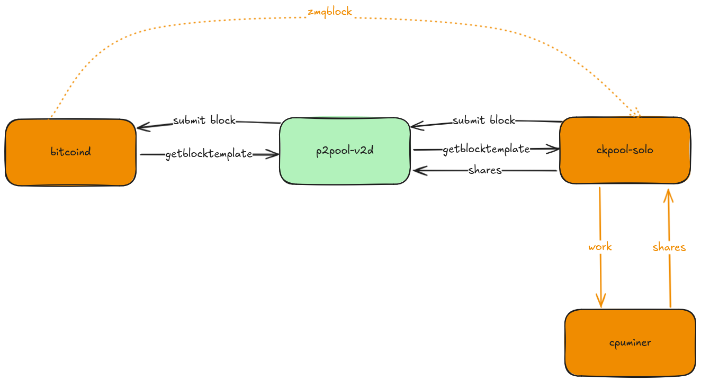

== P2Pool V2

Rebooting P2Pool

1. share chain with uncles - all your work is accountied for
2. pay large miners in coinbase - non custodial solution for top N miners
3. support transactions - pay all miners with atomic swaps with market makers
4. market makers buy shares from smaller miners - earning virgin coins

== Setup with Docker

Start your local p2pool node:

`docker compose up -d`

Shutdown your local p2pool node:

`docker compose down`

== Masochistic Setup

Follow the guidelines below to setup your local p2pool node. Note, these are not setup instructions,
and we do not support masochistic setups. You are on your own.

. Setup bitcoind
.. Use `docker/bitcoin-signet.conf` as your bitcoin.conf
. Point your miners to ckpool-solo
.. Use `docker/ckpool-solo.json` as your ckpool.json
. Setup p2pool-v2
.. Use src/config.toml as starting point for your config.toml
. Point your miners to p2pool-v2

== Architecture

A high level overview of the components used and the interaction between them is shown below.

